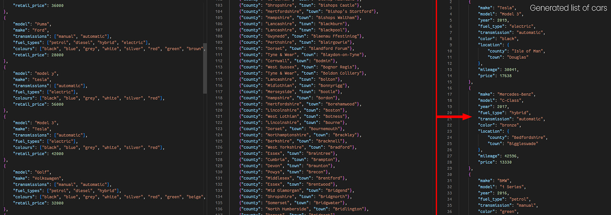
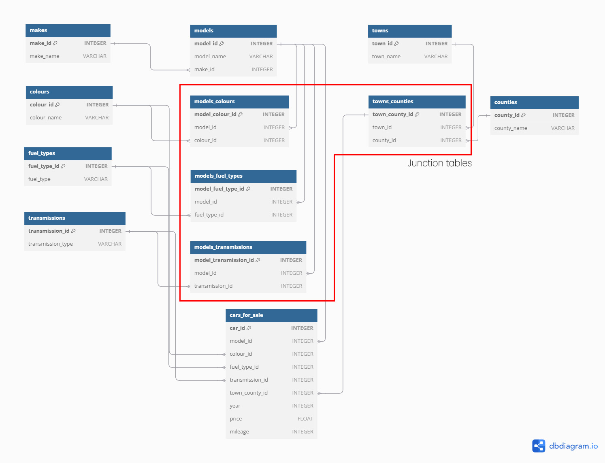

# Arthur's Motors
Building a mock automative marketplace.

## Initial Task
I have created some sample json data for **cars** and **locations** with which a mock database of cars for sale will be created.

The cars and locations are randomly chosen and a random age and mileage are added. Based on the mileage, age and the car's initial RRP a price is calculated. This is then save as a json file.

From the generated json, with the help of Pandas and SQL Alchemy a relational database will be created.

### Tables and relations:

- **Towns and Counties** (many-to-many): A county has many towns. A town has many counties. e.g. The town Newport can be found in Gwent, Isle of Wight and Shropshire

- **Makes and Models** of car (one-to-many): A make can have many models. A model has only one make

- **Models and Colours** (many-to-many): A model can have many colours. A colour can have many models

- **Models and Fuel Types** (many-to-many): A model can have a few fueltypes. A fueltype can have many models

- **Models and Transmissions** (many-to-many): A model can have a few transmission types. A transmission type can have many models

An **ERD** diagram to illustrate:

## Front End Task

The goal is to create a form that will allow you to filter through the cars, based on make, model, colour, mileage, location etc. I would like the form to update available selections as you input with a current number of available cars based on the selected filters.

The results will be displayed in rows and ideally will have clip images. I would also like to implement pagination for the results page.

## Learning goals

- To improve my abilites to wrangle with data and create a useable database
- To improve my Pandas, SQL Alchemy and Postgres SQL skills
- To be able to create a dynamic chained form that updates based on filters
- To be able to create paginated results.
